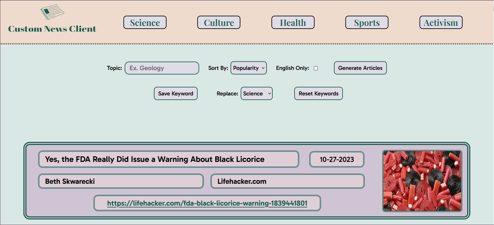
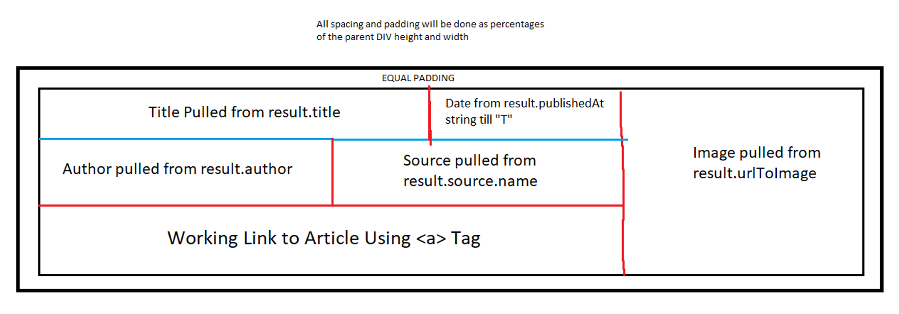
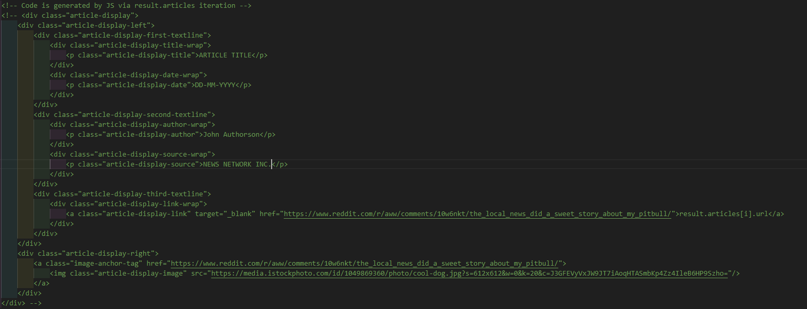

# Logan White 10/30/23

# Custom News Client 

# Introduction / Features

Custom News Client is a website that generates a list of news articles, curated from a user inputted keyword and a variety of options. Articles can be sorted by Popularity, Relevancy, or Recency. There is an option to only display articles written in English. There are five buttons in the header that are reserved for saving keywords that are kept inside local storage so articles can be generated for the topic quickly. There is targeting for which keyword to save over when saving a new one. Generated articles have all of their information displayed in a stylish display, and clicking on the display will open the article in another tab.

# UI Breakdown

This website has a fixed header, which has a website logo on the left, and five custom keyword buttons on the right. Below the header, there are two flexbox lines elements dedicated to managing the input and saved keywords respectively. 

From left to right, the first line contains the Topic Input, the Sort By dropdown element, the English Only checkbox, and the Generate Articles Button. Pressing the Generate Articles button will source the values from the first three inputs, and make a fetch request to the News API. 

From left to right, the second line contains the Save Keyword Button, the Select Replace dropdown, and the Reset Keywords button. Pressing the Save Keyword button will replace the saved keyword button selected by the dropdown with the current text in the Topic Input field. Pressing the Reset Keywords button goes restores all five of the custom keyword buttons to their default values.

Below the second input line is an error field that is invisible by default, but outputs an error message when the fetch request doesn't process correctly, with different messages for different situations.

Below this error field, the list of articles is printed all the way to the bottom of the page. Each article display split into two columns. The right column has an image from the article that can be pressed to open the article in a new page. THe left column has three lines. The first line has the Title and Publication Date of the article. The second line has the Author and Source for the article. The third line has a link to the article. Note that the article display is uniform, since the HTML is generated by JS for each valid article. Below is a screenshot of the UI, as well as the grid layout sketch I made to base the HTML for the article display on.

The color scheme used for this website was generated on Cooler.co. All buttons have transition states, and the website has media query scaling for widths down to 1000px.

# Functionality / Methods

- API Integration & Error Handling:

    This project uses News API, which returns an array of article objects as a result of a fetch request with arguments API key, Keyword, From Date, Language, and SortBy. When the Generate Articles button (or a header saved keyword button) is pressed, a fetch request is passed to the server with arguments sourced from the current values of the HTML elements for the corresponding fields. If the fetch request returns an error, the error output field is updated to signify an error. Similarly, if the given keyword produces no outputs, a different message saying the keyword yielded no results is output.

    NOTE: SINCE I AM USING A DEVELOPER PLAN FOR THIS API, I AM LIMITED TO ONLY 100 FETCH REQUESTS A DAY, AND CAN ONLY SEARCH FOR ARTICLES 30 DAYS OLD.

- Parsing Inputs for Fetch Requests:

    Passing each of the individual arguments through the fetch request is different for each value. The API key is the most simple, since it is just hardcoded into the fetch request. The keyword is passed as a string, but is converted to lowercase first using substring() + toLowercase(). The From Date creates a date object using new Date(), and finds the date 30 days ago through series branch logic that rolls january into decemember of last year, or the 1st of May into the 30th of April, etc. The Language argument is dependant on a checkbox, where the URL used to make the fetch request includes a "language=en" argument if the checkbox value is true. Finally, SortBy is handled using the .value attribute for the dropdown element.

- Header Generation & Saving Keywords:

    Since the header buttons rely on local storage to save the keywords the user saved last time, the HTML must be generated through iterating an array of keywords. This was done using logical OR, where the default value is used if localStorage.getItem() returns falsey. Once we have this array of keywords, HTML generation can be done using a forEach() loop alongside a template string that gets HTML added to it each iteration. The value is used for the innerHTML to display the keyword on the button, as well as the dataset attribute to pass the keyword into the button onclick function. The index is used for the class of the button, so each individual header button can be targeted by querySelector().

    This process is kept in two functions: updateCustomKeywordArray(), which pulls from local storage to update the array, and updateHeaderHTML(), which iterates the array to generate the header HTML and updates the values in the dropdown menu for choosing which keyword to save over to reflect the five keywords saved in local storage.

    Anytime a user saves a new keyword using by pressing the Save Keyword button, the current value inside of the text input field is saved using localStorage.setItem(), where the ID for the item to save over is sourced from the Replace Dropdown menu, which has an option for each of the five current stored keywords. After saving in local storage, the two functions explained above are called to make the webpage reflect the state of the current local storage.

- Header Button Onclicks:

    The two functions described above handle the visual compoents for the header buttons, but the process for adding onclick listeners to each of them are handled by two more functions who are modeled simialrly. 

    First, updateHeaderButtonElemArray() is a function that updates an array to make it contain each of the five HTML elements for the header button. This must be done again each time the values change, since the process of generating new HTML code for the header necesitates a re-calling of the HTML elements into the code to ensure the right dataset values are sourcable.

    Second, updateHeaderButtonOnclicks() is a function that iterates the button elements in this array, and adds an onclick listener to each that uses the dataset keyword passed through the element as an argument for renderArticleFeed(), a function described in the next section.

    This means that, in total, the process for saving a new keyword and updating the website visually and functionally can be done with the calling of four functions, in this order:
        - updateCustomKeywordArray()
        - updateHeaderHTML()
        - updateHeaderButtonElemArray()
        - updateHeaderButtonOnclicks()

- Article Feed Rendering & Article Validation:

    The largest function in this progam is renderArticleFeed(), which accepts arguments sourced from HTML elements, parses those arguments so they are formatted correctly for the fetch request, uses the article array returned by the fetch request to generate HTML for the article feed, and pastes it onto the website.

    Here is the general form for the HTML structure of each element:

    

    By iterating each of the articles, and using a template string to insert the innerHTML for each value as an attribute of the article object, the entire feed can be generated by managing an output string that recives each individual article's HTML one at a time, before pasting the entire thing onto ArticleOutputWrap, a vertical flexbox that allows the user to scroll all the way down the page until all articles have been shown.

    Each article is validated before they are added to the HTML output string. This is done by checking the image URL and title, and if either is null, the iteration is skipped before the string gets added.

# Core Skills Used

- UI Design + Implimentation using flexboxes, HTML, and CSS

- Text Overflow handling with CSS

- Width Scaling using media queries

- Program Design using modular functions

- Asyncronous code using JS Promises

- Communicating with an API using fetch() in JS

- HTML Generation using template strings in JS

- Local Storage Management in JS
